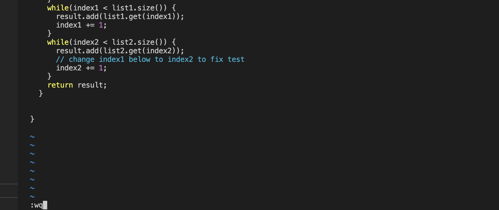

# Lab Report 4
## Rohan Upalekar

## Part 4- Logging into Ieng

Logged in via `ssh rupalekar@ieng6.ucsd.edu` and then pressed `<enter>` key to login.

## Part 5- Clone your fork of the repository from your Github account (using the SSH URL)

Copied the link  `git clone https://github.com/rupalekarucsd/lab7.git` from Github and used the command `<Ctrl> + <V>` to clone the forked repo into my ieng directory and then pressed `<enter>`. 

## Part 6- Running the tests (Fail)
Then ran the command `ls` to see the different folders in the server. I then used the command `cd lab7` to change the directory to the lab7 folder. Subsequently I ran the tests with `<Ctrl> + <V>` to input `javac -cp .:lib/hamcrest-core-1.3.jar:lib/junit-4.13.2.jar *.java` to compile the files `<enter>`. Repeated with  `<Ctrl> + <V>` and `java -cp .:lib/hamcrest-core-1.3.jar:lib/junit-4.13.2.jar org.junit.runner.JUnitCore ListExamplesTests` to run the tests for ListExamplesTests.java (test file for `ListExamples.java`). Alternatively we could've used command `bash test.sh`. As we can see, the tests have failed, and we need to fix them. 

## Part 7- Editing the Code

Opened up the file ListExamples.java in vim with command `vim ListExamples.java <enter>`
This opened up the file as an editor. 
To get to `Index1`
Had to press `<down key>` `20` times and `<left key>` `6` times to get to the desired character to change. 

Then had to press `<x>` to delete and `<i>` to insert the following key `2` to replace `index1` with `index2`. 

After exiting insert mode by pressing `<i>` again, to exit Vim and save the edit, had to press `<:wq>` and `<enter>`. This saves the file with the new edits, and exits the Vim interface back to our main command line. 

## Part 8- Running the edited tests (Pass)

Used `bash test.sh <enter>` a shortcut to run the updated test files. As we can see, the update allowed them to pass. 

## Part 9- Committing code to Github

To initialize the git repo, I used command `git init <enter>`. Then I ran `git add ListExamples.java <enter>` to add the modified file to the pipeline. Then I ran `git commit -m "V2" <enter>` to commit the changes as well as a brief message to display that this was an alternate updated version. Finally pushed the changes via `git push origin main`.

As we can see the code is updated. 

