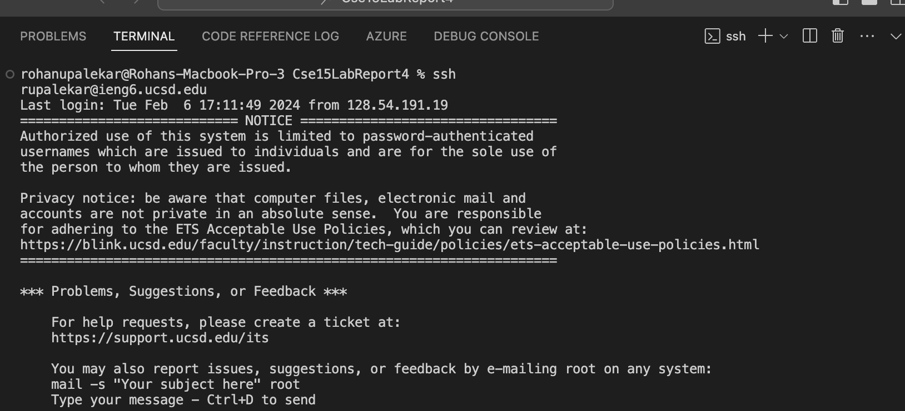
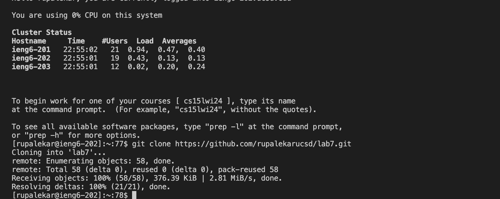
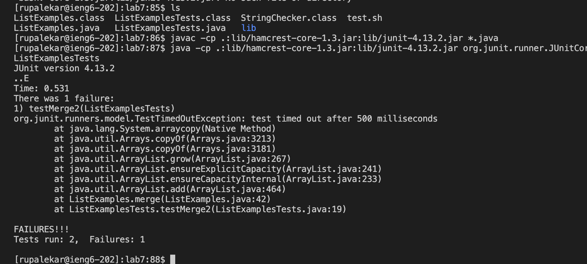
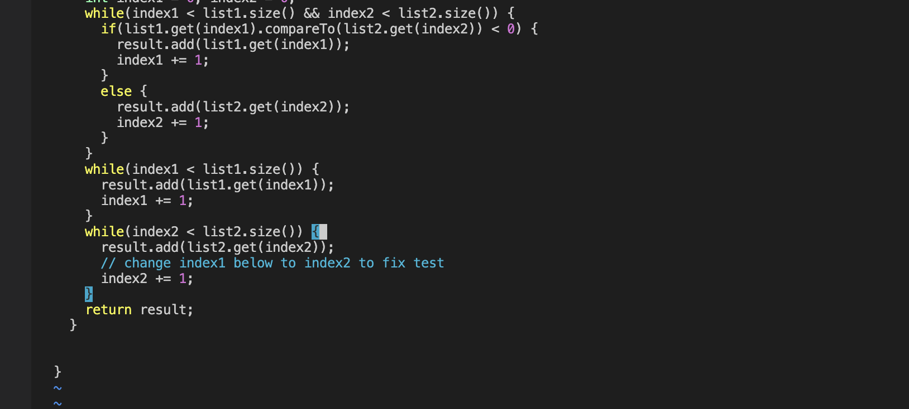
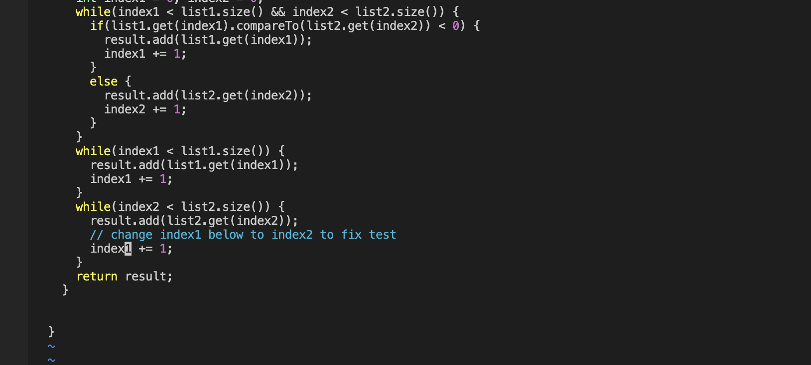
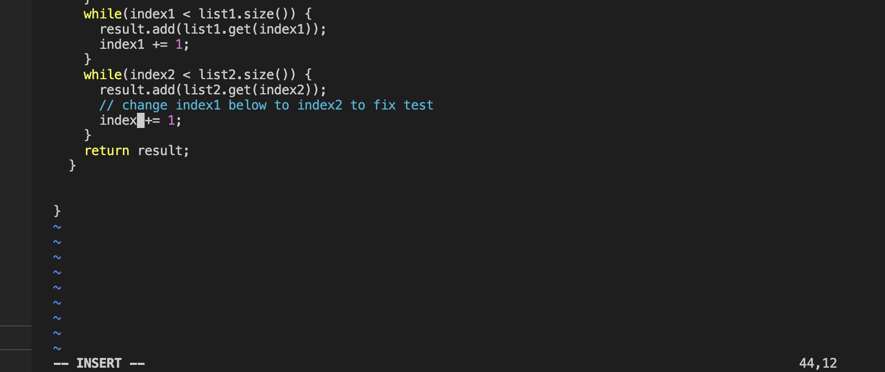
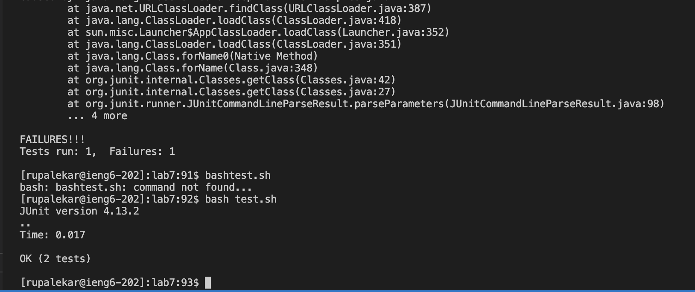
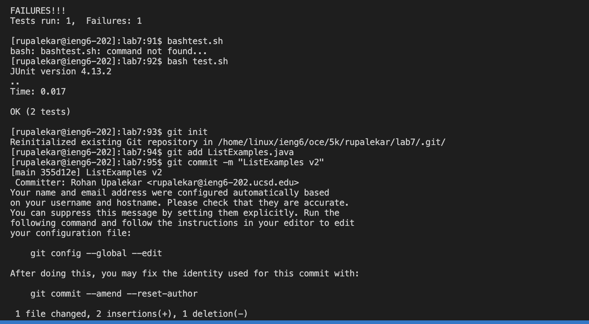
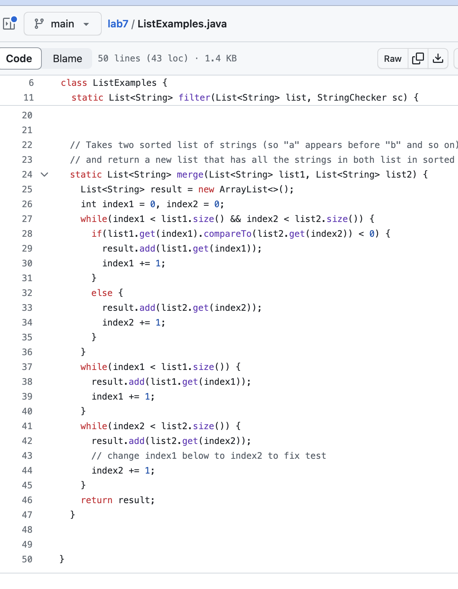

# Lab Report 4
## Rohan Upalekar

## Part 4- Logging into Ieng

## Part 5- Clone your fork of the repository from your Github account (using the SSH URL)

## Part 6- Running the tests (Fail)

## Part 7- Editing the Code

## Part 8- Running the edited tests (Pass)

## Part 9- Committing code to Github

