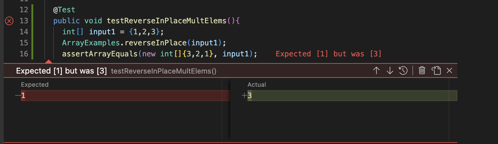
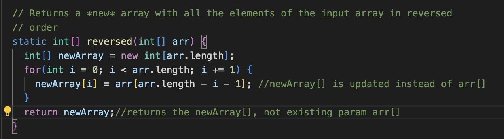

# Lab Report 3
## Rohan Upalekar

## Part 1- Bugs




The bug made the `reverseInPlace()` method return half the elements reversed, and the second half of elements the same. This meant that for example array `[1,2,3`] reversed would return `[3,2,3]`. 

An input that wouldn't induce failure would be for example: 


`assertArrayEquals(new int[]{1,2,1}, {1,2,1};` 

This test would yield true even thought the program worked improperly as the method works for palindromes. Another example of an error inducing test would be array `[1,2]`. In turn the final reversedElements would return `[2,2]`. I was only able to take one screenshot in lab with an error inducing output, and my IDE won't allow any further testing even after 3-4 different clones into different directories etc. Please excuse any missing images, I will address the prompt otherwise. 


## The fixed code is as shown below.


To have fixed the code we changed the original method, shown below, by changing arr[i] to newArray[i] within the for loop. This avoids alteration of the original array passed in, which was causing the bug initially:


```
static int[] reversed(int[] arr) {

    int[] newArray = new int[arr.length];

    for(int i = 0; i < arr.length; i += 1) {

      arr[i] = newArray[arr.length - i - 1];

    }

    return arr;

  }

```


## Part 2- Researching Commands (grep)
## grep -color


Identifies the text input provided and returns the word and line with the word highlighted in that color. Makes it easy to identify a specific word in a large file by color. In these cases we highlighted the foobalbar player to show him in a list of baseball players. In the whitepaper of a crypto token before, it is easy to highlight the code that contains the function `mapping`. 
## grep -c


Identifies the count of the input provided and returns the count of the word or phrase in the file. The examples below are rather self explanatory. This results in an easy method to identify how many times a phrase/word is repeated. 


## grep -o


Prints the phrase if it is contained in the text file. This is useful to see whether the input provided exists or not. In the examples below it is shown that a file with the input provided of `wargare..` returns itself as it is present. That said, if the input isn't present in the text file, i.e `hi`, then nothing is returned relaying its absence in the file. 

### grep -i


Prints all occurrences of the given input while ignoring it's case. This is the key idea of the `grep -i` command. It will subsequently print all occurrences of the input in the file. In the first example of `-i Ros` most occurrences of Ros and Rosencrantz are upper case, however in the example of `-i "My Lord"` there are plenty of lowercase mentions of the input, and the utility of the command is highlighted. 
