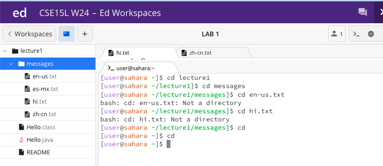
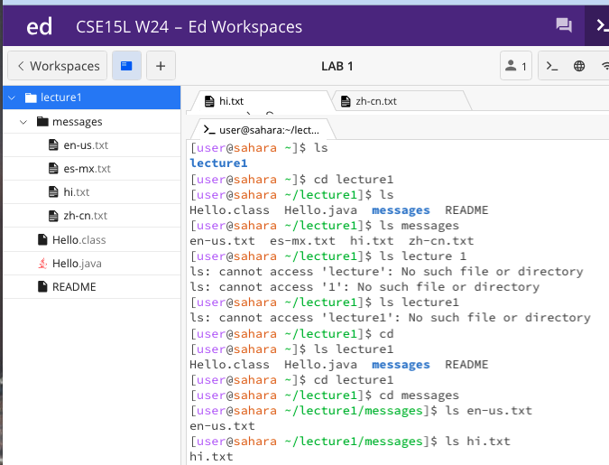
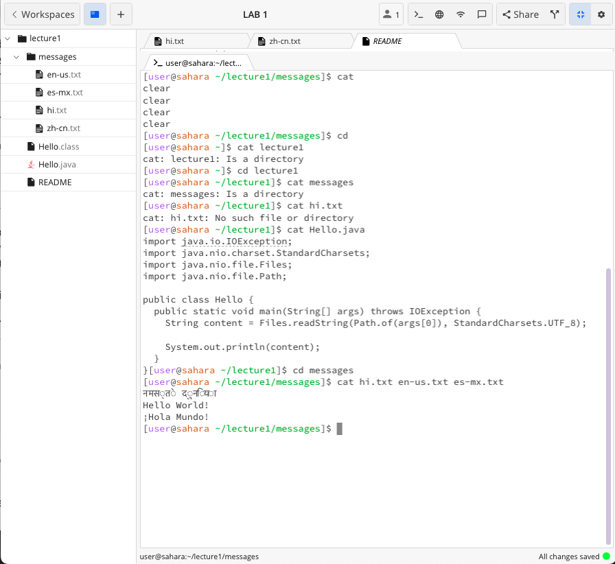

# Lab Report 1

## Rohan Upalekar

The cd command with no arguments resets the directory to the  home (main) directory. Regardless of the working directory (/home/lecture1 or /home/lecture1/messages) it'll always reset it to /home. We tried it with /home/lecture1/messages as the working directory. The output isn't an error.

The cd command with a path to a directory as an argument will set that directory as your current working directory. Bear in mind, you can only go one level up ie, cd lecture1, and then cd messages. If you try to directly go cd messages it'll say:

`[user@sahara ~]$ cd messages`

`bash: cd: messages: No such file or directory`

When running command, we are always in a directory that is one out of the other (ie cd messages is ran in /home/lecture1 and cd lecture1 is ran in /home). To bypass the one directory rule, we can run cd lecture1/messages to directly change into the messages directory. 

The cd command with a path to a file as an argument throws an error. Regardless of what working directory you're in, you cannot cd into a file. Cd stands for change directory not file. To go back to the original home directory cd works out, but `cd..` will take you up one level if that's what you want instead.

---

The ls command with no arguments lists off the contents of the directory it's currently in. For example, in our first examples it lists lecture1 as it's in the /home directory. That said after we cd into lecture1 and run ls, it'll return all the contents of the /home/lecture1 directory as shown in the image. This doesn't return an error.

The ls command with a path to directory will list the contents of that directory provided it's only one directory down the chain. This means provided you're in the home directory, you can run the command ls lecture1. That said if you're in the home directory and run: 

`[user@sahara ~]$ ls messages`

`ls: cannot access 'messages': No such file or directory`

Thus throwing an error proving that the command only has scope one level down the chain. Running ls messages in /home/lecture1 will work as intended.

The ls command with a path to a file as an argument works very similarly to the ls command with a path to a directory as the argument. The same error message will be thrown if the argument doesn't contain a file in that same working directory. As we can see ls hi.txt and en-us.txt list their respective file names, but only in the /home/lecture1/messages directory. 

---

The cat command with no arguments does something interesting. It seems that the command reads from the terminal, thus simply returning whatever command you put into it. The edstem discussion suggests that this may or may not be an error, however to resolve this you have to press `Ctrl/Cmd + c`. Regardless of your working directory, this command will lead to this, and so far doesn't seem to have a viable use for us. 

The cat command with a path to a directory as an argument will lead to an error. Although it could seem similar to ls, ls should be the go to command for trying to display the contents of a directory. As you can see, running `cat messages` in the /home/lecture1 directory leads to the error `cat: messages: Is a directory`. This is because the cat command's job is to list the contents of a file, and the command isn't built to list the contents of a directory.

The cat command with a path to a file as an argument is the correct way to use the command. Provided you are in the correct working directory, running cat and then the filename will print the contents of the file. As we can see, we ran cat Hello.java in the /home/lecture1 directory, and it printed the contents of the Hello.java file. We can also have multiple arguments in the cat command, provided the files are in the same directory. After cd-ing into the messages directory, running cat with multiple commands yielded:

`cat hi.txt en-us.txt es-mx.txt`

`नमसत दनया`

`Hello World!`

`¡Hola Mundo!` 

The respective contents of each file all together, it's good to get the contents of a select group of relevant files to you. 
