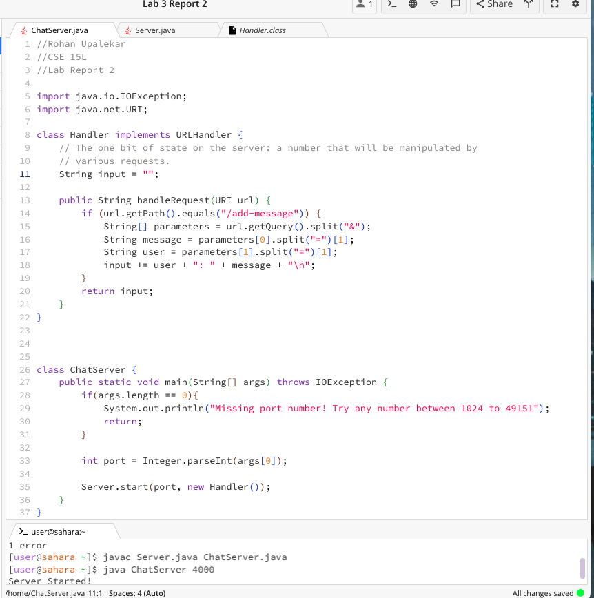
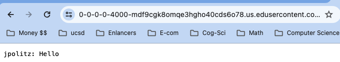
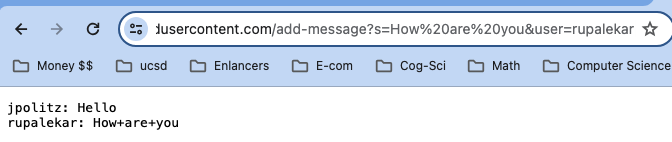
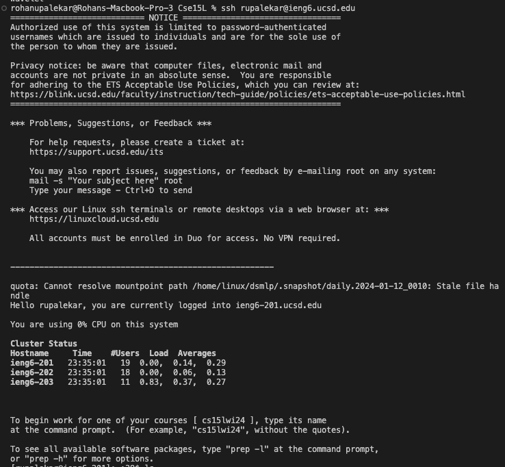

# Lab Report 1

## Rohan Upalekar

## Screenshot of addmessage 1

The methods in my code that are called are handleRequest(URI url). The relevant arguments are the add message commands in the url: /add-message?s=Hello&user=jpolitz etc. These are stored in the String input variable. The variables change as new commands get added. String input starts as an empty string (""). As more add commands are typed, it gets stored in that variable, thus displaying the messages, and future messages when they are added(jpolitz + ": " + Hello + "\n"). 

---

## Screen shot of addmessage 2

he methods in my code that are called are handleRequest(URI url). The relevant arguments are the add message commands in the url: /add-message?s=How are you&user=rupalekar etc. This argument is stored in the String input variable which already contains the previous command. The current value of input has changed to: (jpolitz + ": " + Hello + "\n" + rupalekar + ": " + How are you + "\n"). 

---

## Screenshot of ieng login wo password

 
