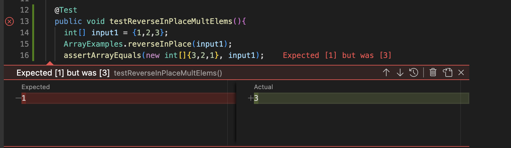
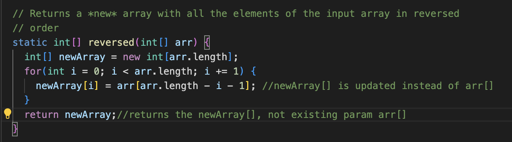

# Lab Report 3
## Rohan Upalekar

## Part 1- Bugs

The bug made the `reverseInPlace()` method return half the elements reversed, and the second half of elements the same. This meant that for example array `[1,2,3`] reversed would return `[3,2,3]`.

An input that wouldn't induce failure would be for example: 

`assertArrayEquals(new int[]{1,2,1}, {1,2,1};` 

This test would yield true even thought the program worked improperly as the method works for palindromes. 

## The fixed code is as shown below.

To have fixed the code we changed the original method:

static int[] reversed(int[] arr) {

    int[] newArray = new int[arr.length];
    
    for(int i = 0; i < arr.length; i += 1) {
    
      arr[i] = newArray[arr.length - i - 1];
      
    }
    
    return arr;
    
  } 

