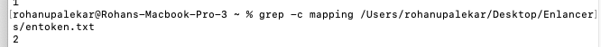

# Lab Report 3
## Rohan Upalekar

## Part 1- Bugs


The bug made the `reverseInPlace()` method return half the elements reversed, and the second half of elements the same. This meant that for example array `[1,2,3`] reversed would return `[3,2,3]`. 

An input that wouldn't induce failure would be for example: 


`assertArrayEquals(new int[]{1,2,1}, {1,2,1};` 

This test would yield true even thought the program worked improperly as the method works for palindromes. Another example of an error inducing test would be array `[1,2]`. In turn the final reversedElements would return `[2,2]`. I was only able to take one screenshot in lab with an error inducing output, and my IDE won't allow any further testing even after 3-4 different clones into different directories etc. Please excuse any missing images, I will address the prompt otherwise. 


## The fixed code is as shown below.


To have fixed the code we changed the original method, shown below, by changing arr[i] to newArray[i] within the for loop. This avoids alteration of the original array passed in, which was causing the bug initially:


```
static int[] reversed(int[] arr) {

    int[] newArray = new int[arr.length];

    for(int i = 0; i < arr.length; i += 1) {

      arr[i] = newArray[arr.length - i - 1];

    }

    return arr;

  }

```


## Part 2- Researching Commands (grep)
## grep -color





